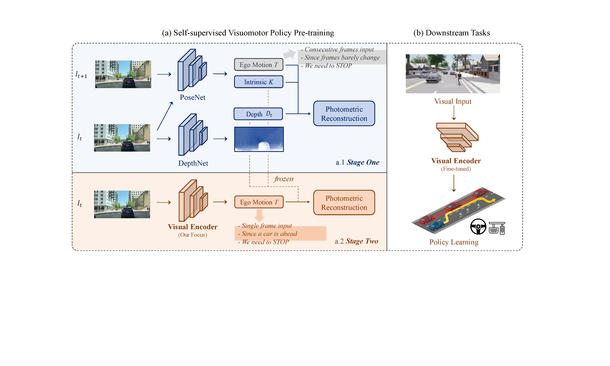

<div align="center">   
  
# PPGeo: Policy Pre-training for Autonomous Driving via Self-supervised Geometric Modeling
</div>



> Policy Pre-training for Autonomous Driving via Self-supervised Geometric Modeling 
>
> - [Penghao Wu](https://scholar.google.com/citations?user=9mssd5EAAAAJ&hl=en), [Li Chen](https://scholar.google.com/citations?user=ulZxvY0AAAAJ&hl=en&authuser=1), [Hongyang Li](https://lihongyang.info/), [Xiaosong Jia](https://jiaxiaosong1002.github.io/), [Junchi Yan](https://thinklab.sjtu.edu.cn/), [Yu Qiao](http://mmlab.siat.ac.cn/yuqiao/)
> - [arXiv Paper](https://arxiv.org/abs/2301.01006) | [openreview](https://openreview.net/forum?id=X5SUR7g2vVw), ICLR 2023
> - video | [blog](https://zhuanlan.zhihu.com/p/601456429)

This repository contains the pytorch implementation for PPGeo in the paper [Policy Pre-training for Autonomous Driving via Self-supervised Geometric Modeling](https://arxiv.org/abs/2301.01006). PPGeo is a fully self-supervised driving policy pre-training framework to learn from unlabeled driving videos.

## Pre-trained Models

<!---
| [Visual Encoder (ResNet-34)](https://drive.google.com/file/d/1GAeLgT3Bd_koN9bRPDU1ksMpMlWfGXbE/view?usp=sharing) | [DepthNet](https://drive.google.com/file/d/1bzRVs97KbPtfXE-1Iwe60bUD4i0JXxhh/view?usp=sharing) | [PoseNet](https://drive.google.com/file/d/1sDeuJIvfC01NFyuLFyPI3-yihQRsmLY_/view?usp=sharing) |
|:--------------:|:--------:|:-------:|
--->

| Model | Link |
|:--------------:|:--------:|
| Visual Encoder (ResNet-34) | [ckpt](https://drive.google.com/file/d/1GAeLgT3Bd_koN9bRPDU1ksMpMlWfGXbE/view?usp=sharing) |
| DepthNet | [ckpt](https://drive.google.com/file/d/1bzRVs97KbPtfXE-1Iwe60bUD4i0JXxhh/view?usp=sharing) |
| PoseNet | [ckpt](https://drive.google.com/file/d/1sDeuJIvfC01NFyuLFyPI3-yihQRsmLY_/view?usp=sharing) |


## Get Started

- Clone the repo and build the environment.

```
git clone https://github.com/OpenDriveLab/PPGeo.git
cd PPGeo
conda env create -f environment.yml --name PPGeo
conda activate PPGeo
```

- Download the driving video dataset based on the instructions in [ACO](https://github.com/metadriverse/ACO).

- Make a symlink to the dataset root.

```
ln -s DATA_ROOT data
```

- Preprocess the data.

```
python ytb_data_preprocess.py
```

## Training

- First stage training.

```
python train.py --id ppgeo_stage1_log --stage 1
```

- Second stage training.

```
python train.py --id ppgeo_stage2_log --stage 2 --ckpt PATH_TO_STAGE1_CKPT
```


## Citation

If you find our repo or our paper useful, please use the following citation:

```bibtex
  @inproceedings{wu2023PPGeo,
    title={Policy Pre-training for Autonomous Driving via Self-supervised Geometric Modeling},
    author={Penghao Wu and Li Chen and Hongyang Li and Xiaosong Jia and Junchi Yan and Yu Qiao},
    booktitle={International Conference on Learning Representations},
    year={2023}
  }
```

## License
All code within this repository is under [Apache License 2.0](https://www.apache.org/licenses/LICENSE-2.0).

## Acknowlegement
Our code is based on [monodepth2](https://github.com/nianticlabs/monodepth2).

